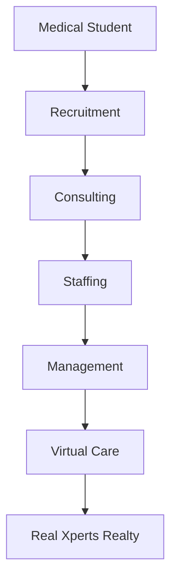

# Med Xperts Group

## Business Plan (2026–2031)

### Vision

To become Canada's most trusted healthcare ecosystem connecting healthcare professionals, clinics, investors, and patients.

### Mission

Provide end-to-end solutions for healthcare professionals from graduation to retirement.

---

## 1. Med Xperts Recruitment

**Connecting Healthcare Talents**

### Services
- Physician Recruitment
- Nurse Recruitment
- Allied Health Recruitment
- Executive Search
- International Recruitment

### Clients
- Family Health Organizations
- Walk-in Clinics
- Hospitals
- Long-Term Care
- Private Clinics

### Revenue
- Placement Fee
- Retainer Recruitment
- Executive Search

---

## 2. Med Xperts Consulting

**Building Better Healthcare Businesses**

### Services

#### For Physicians
- Contract Negotiation
- Professional Corporation
- Tax Planning
- Billing Optimization
- Career Planning

#### For Clinics
- Clinic Setup
- Business Planning
- Expansion Strategy
- Financial Analysis
- HR Consulting

### Revenue
- Consulting Fee
- Membership Program
- Workshops
- Online Courses

---

## 3. Med Xperts Staffing

**Reliable Healthcare Workforce**

### Services

#### Temporary Staffing
- Registered Nurses
- RPN (Registered Practical Nurse)
- PSW (Personal Support Worker)
- MOA (Medical Office Assistant)
- Clinic Assistants
- Administrative Staff
- Pharmacist
- Pharmacist Assistant

#### Permanent Staffing
- Office Managers
- Medical Receptionists
- Billing Specialists

### Revenue
- Hourly Staffing Margin
- Permanent Placement
- Managed Staffing Contract

---

## 4. Med Xperts Management

**Complete Clinic Management Solutions**

### Services

#### Clinic Management
- HR
- Payroll
- Bookkeeping
- Compliance
- Scheduling
- EMR (Electronic Medical Record) Support
- Marketing
- Patient Experience

#### Physician Services
- Billing
- Credentialing
- Licensing
- Incorporation Support

### Revenue
- Monthly Management Fee
- Percentage of Clinic Revenue
- Administrative Services

---

## 5. Med Xperts Virtual Care

**Healthcare Without Boundaries**

### Services
- Virtual Family Medicine
- Walk-in Clinic
- Mental Health
- Specialist Referrals
- Chronic Disease Follow-up
- Second Opinions

### Technology
- Telemedicine Platform
- Online Booking
- Electronic Prescription
- Secure Patient Portal

### Revenue
- OHIP Billing
- Private Virtual Visits
- Corporate Health Programs
- Employer Contracts

---

## 6. Real Xperts Realty Inc., Brokerage

**Real Estate Solutions for Healthcare Professionals**

### Services

#### Residential
- Buy
- Sell
- Invest

#### Commercial
- Medical Office Purchase
- Medical Office Leasing
- Clinic Investment
- Land Acquisition

#### Investment
- Rental Properties
- Pre-Construction
- Commercial Buildings

#### Special Programs
- First Home for Doctors
- Mortgage Solutions
- Investment Planning
- Relocation Services

### Revenue
- Real Estate Commission
- Commercial Transactions
- Investment Advisory Partnerships

---

## Business Ecosystem

Each client progresses through multiple services within the Med Xperts ecosystem, creating long-term relationships instead of one-time transactions.

---

## Five-Year Goals

| Division | Target |
| :--- | :--- |
| **Recruitment** | 500+ healthcare placements per year |
| **Consulting** | 1,000+ physicians advised |
| **Staffing** | 300+ active healthcare professionals |
| **Management** | 100+ clinics under management |
| **Virtual Care** | 50,000+ patient visits annually |
| **Real Xperts Realty** | Become the #1 real estate brokerage serving healthcare professionals in Ontario |

---

## Competitive Advantage

Unlike traditional companies that specialize in only one service, **Med Xperts Group** provides a complete lifecycle solution for healthcare professionals:

- Career Placement
- Contract Negotiation
- Professional Corporation Setup
- Staffing Solutions
- Clinic Management
- Virtual Care
- Home Buying
- Medical Office Acquisition
- Real Estate Investment
- Financial & Business Planning

---

## The Med Xperts Vision

Med Xperts Group is designed as a **One-Stop Healthcare Business Ecosystem**, bringing together recruitment, consulting, staffing, clinic management, virtual healthcare, and real estate under one trusted brand.

This integrated ecosystem creates recurring revenue, strengthens client loyalty, and positions Med Xperts Group as Canada's premier business partner for healthcare professionals throughout every stage of their careers.
